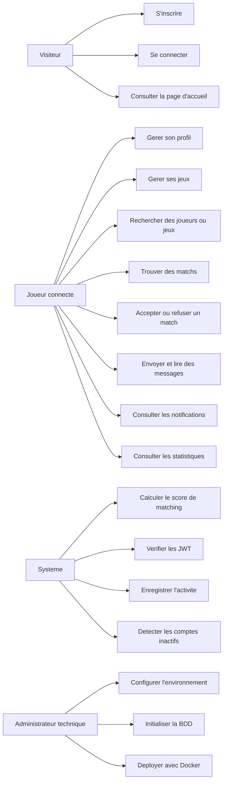

# 02 - Analyse

## Diagramme des cas d'utilisation

## Regles metier

| Code | Regle |
| --- | --- |
| RM01 | Un email utilisateur est unique. |
| RM02 | Un pseudo utilisateur est unique, contient 3 a 50 caracteres et accepte lettres, chiffres et underscore. |
| RM03 | Un mot de passe doit contenir au minimum 8 caracteres, dont au moins une lettre et un chiffre. |
| RM04 | Les mots de passe sont stockes sous forme de hash bcrypt. |
| RM05 | L'acces aux routes protegees necessite un token JWT valide. |
| RM06 | Un utilisateur possede au maximum un profil. |
| RM07 | Un utilisateur doit avoir au moins 13 ans si sa date de naissance est renseignee. |
| RM08 | Un profil prive ne doit pas etre propose dans le matching. |
| RM09 | Un utilisateur ne peut pas ajouter deux fois le meme jeu a son profil. |
| RM10 | Le score de matching est calcule sur 100 maximum. |
| RM11 | Le matching compare les jeux communs, les niveaux, la region, le fuseau horaire et l'objectif recherche. |
| RM12 | Un match entre deux utilisateurs est unique. |
| RM13 | Un message ne peut etre envoye qu'entre deux utilisateurs ayant un match accepte. |
| RM14 | La suppression d'un message est logique : le champ `deleted_at` est renseigne au lieu de supprimer la ligne. |
| RM15 | Les notifications peuvent etre filtrees, lues ou supprimees par leur proprietaire. |
| RM16 | Un compte peut etre considere inactif apres 30 jours sans activite. |

## Algorithme de matching

Le service `API/app/services/matching.py` calcule un score pondere :

| Critere | Poids |
| --- | --- |
| Jeux en commun | 30 points par jeu, limite a 60 |
| Compatibilite du niveau par jeu | Jusqu'a 30 |
| Niveau global | Jusqu'a 20 |
| Meme region | 15 |
| Meme fuseau horaire ou fuseau proche | Jusqu'a 10 |
| Objectif recherche compatible | Jusqu'a 15 |

Le score final est arrondi et limite a 100. Les resultats sont tries par score decroissant.

## Justification des choix technologiques

| Choix | Justification BTS SIO SLAM |
| --- | --- |
| React + Vite | Permet de construire une SPA moderne, modulaire, rapide a developper et facilement testable avec Jest. |
| FastAPI | Framework Python adapte aux API REST, documentation Swagger automatique, validation avec Pydantic. |
| MySQL | SGBDR classique, adapte au MCD/MLD et aux relations utilisateurs/jeux/matchs/messages. |
| JWT | Authentification stateless adaptee a une API REST consommee par un frontend separe. |
| bcrypt | Hachage robuste pour les mots de passe. |
| Docker Compose | Facilite la mise a disposition du service avec trois conteneurs : BDD, API, frontend. |
| Nginx | Sert le build React en production et simplifie l'exposition du frontend. |
| Axios | Centralise les appels HTTP et l'injection du token dans les requetes. |

## Analyse des risques

| Risque | Impact | Mesure prevue |
| --- | --- | --- |
| Secret JWT faible en production | Compromission des comptes | Variable `JWT_SECRET` obligatoire en production. |
| Donnees invalides dans les formulaires | Erreurs applicatives | Validation Pydantic cote backend. |
| Base non initialisee | API inutilisable | Scripts SQL versionnes et montage Docker init. |
| CORS mal configure | Frontend bloque | Variable `CORS_ORIGINS`. |
| Messagerie abusive | Mauvaise experience utilisateur | Restriction aux matchs acceptes et suppression logique. |
| Donnees personnelles exposees | Atteinte a la vie privee | Visibilite de profil, champs de confidentialite, JWT. |
