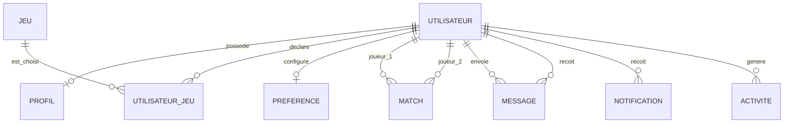
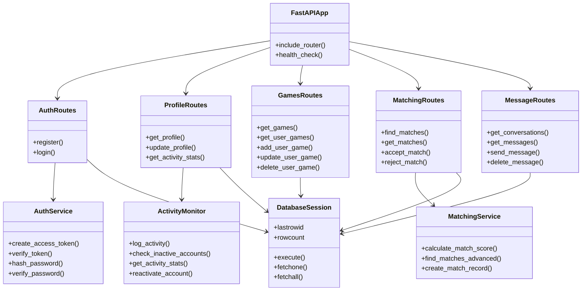
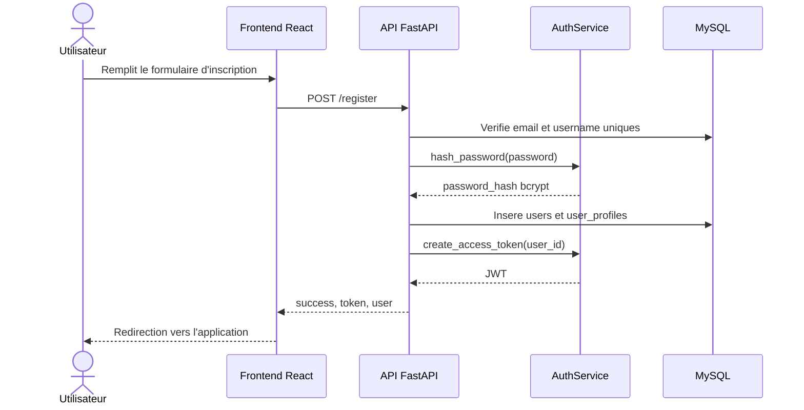
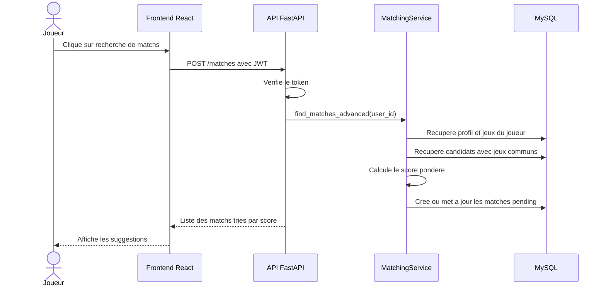
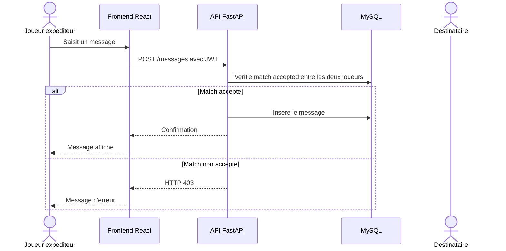
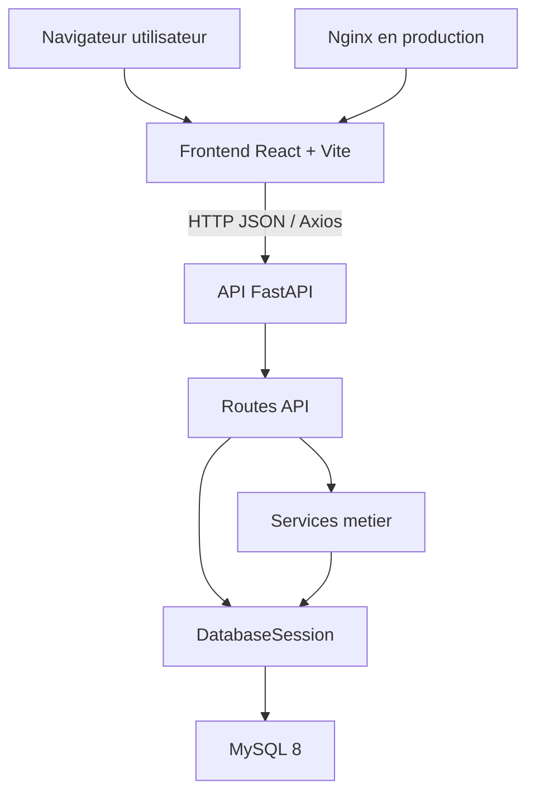

# 03 - Conception

## MCD

Le modele conceptuel represente les entites principales : utilisateur, profil, jeu, association utilisateur-jeu, preferences, match, message, notification et activite.

Voir aussi le fichier Mermaid : [mcd.mmd](mcd.mmd).



## MLD

Le MLD est implemente dans `deploy/docker/mysql-init/00_schema.sql`. Il ajoute les cles primaires, cles etrangeres, index, contraintes d'unicite et types enumeres MySQL.

Voir aussi le fichier Mermaid : [mld.mmd](mld.mmd).

Relations principales :

| Table | Role | Relations |
| --- | --- | --- |
| `users` | Compte et authentification | Liee a toutes les donnees utilisateur. |
| `user_profiles` | Profil social et preferences de confidentialite | `user_id` unique vers `users`. |
| `games` | Catalogue des jeux | Liee a `user_games`. |
| `user_games` | Association N-N utilisateur/jeu | Unique sur `(user_id, game_id)`. |
| `matches` | Mise en relation | Deux FK vers `users`. |
| `messages` | Messagerie privee | FK expediteur et destinataire vers `users`. |
| `notifications` | Evenements utilisateur | FK vers le proprietaire et l'utilisateur source. |
| `user_activity_logs` | Traces d'activite | FK vers `users`. |

## Diagramme de classes simplifie



## Diagrammes de sequence

### Inscription



### Recherche de matchs



### Envoi d'un message



## Maquette fonctionnelle

Les ecrans principaux du frontend sont implementes dans `frontend/src/pages`.

| Ecran | Objectif | Route frontend |
| --- | --- | --- |
| Accueil | Presenter la plateforme et les statistiques | `/` |
| Connexion | Authentifier un utilisateur | `/login` |
| Inscription | Creer un compte et profil initial | `/register` |
| Profil | Consulter et modifier ses informations | `/profile` |
| Jeux | Gerer sa bibliotheque de jeux | `/games` |
| Matching | Voir les suggestions de coequipiers | `/matching` |
| Messages | Echanger avec les matchs acceptes | `/messages` |
| Mentions legales, CGU, confidentialite | Informations legales | `/legal`, `/terms`, `/privacy` |

Wireframe simplifie :

```text
+--------------------------------------------------+
| Navigation : logo, accueil, jeux, matching, profil |
+--------------------------------------------------+
| Contenu principal selon la page                   |
| - cartes de profil / jeux / matchs                |
| - formulaires d'edition                           |
| - listes de messages ou notifications             |
+--------------------------------------------------+
| Footer : liens et informations legales            |
+--------------------------------------------------+
```

## Architecture applicative



L'architecture suit une separation claire :

- Vue : composants et pages React.
- Controleurs API : routes FastAPI.
- Services metier : authentification, matching, activite.
- Modele de donnees : Pydantic pour les DTO et MySQL pour la persistance.

L'API REST expose des ressources coherentes : `/register`, `/login`, `/profile`, `/games`, `/matches`, `/messages`, `/notifications`, `/stats` et `/search`.
